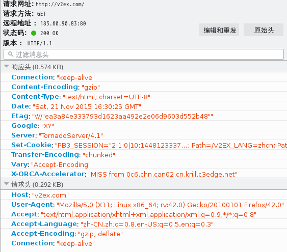

#urllib汇总

####前言

2015.11.16～2015.11.26 tick篇
断断续续地翻译urllib官方文档一个月有余，终于在这周果断地动手抄了四个爬虫，写了一个爬虫。尽管在实现coursera.org爬虫时候是那么的无可奈何。^_^
在这里我想写一写自己的心得（世界这么大，我想表现下自己～_~）

内容分为这几个部分：
* 浏览器工作原理
* _headers——请求头与响应头_


#####浏览器工作原理


#####_headers——请求头与响应头_

这是一个消息头图片：


着重注意下这么几个东西：
* 请求网址：
* 请求方法  
  常用的请求方法是下面两个：
  * GET
  GET，查询之意，符合RFC标准的请求并不会对数据产生修改
  * POST

* 状态码
*

#####_Handler & Opener & Request_

* 使用代理
* 使用Cookie
* 构造Request

#####_http响应对象_

####错误与异常

#####几个例子

* 一般抓取
```
from urllib import request
response = request.urlopen("https://www.google.com")
```

* 表单请求之使用GET方法的抓取
```
from urllib import request
url = "http://tieba.baidu.com/p/3138733512" + "?see_lz=1&pn=1"
response = request.urlopen(url)
```

* 表单请求之使用POST方法的抓取
```
from urllib import request
from urllib import parse

url = 'http://pythonprogramming.net'
values = {'s': 'basic',
          'submit': 'search'}

data = parse.urlencode(values)
data = data.encode('utf-8')
req = request.Request(url, data)
resp = request.urlopen(req)
```

* 使用代理的抓取
```
```

* 使用Cookie的抓取
```
```

* 模拟登陆
```
```
